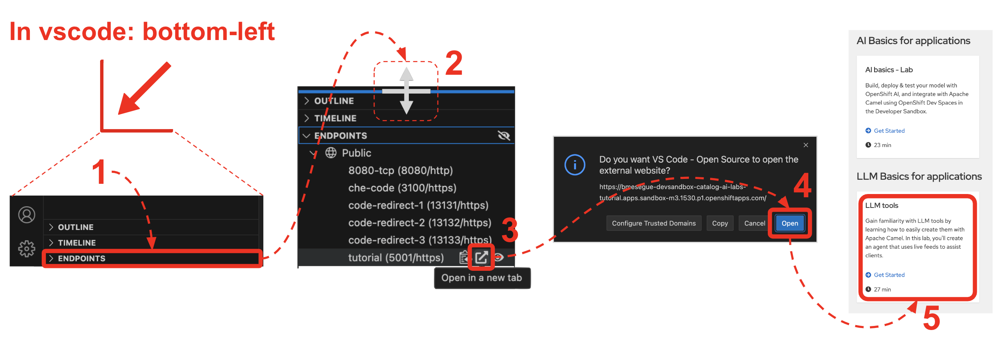

> [!NOTE]  
> If this file is rendered in TEXT mode in VS Code, click the preview button. \
> (upper-right corner, has a `📖+🔍` symbol)

# LLM Basics in the Developer Sandbox

Gain familiarity with *LLM tools* by learning how to easily create them with *Apache Camel*. In this lab, you'll create an agent that uses live feeds to assist clients.

## Get started with the tutorial

> [!NOTE]  
> If using the Developer Sandbox for the first time, you'll be required to register for a Red Hat account.

To launch this tutorial, you only need 2 steps:

1. If you haven't already done so, click the link below to provision the tutorial:

    <sub>(right-click & open in new tab)</sub> \
    [Provision Tutorial in the Developer Sandbox](https://workspaces.openshift.com/#https://github.com/RedHat-Middleware-Workshops/devsandbox-catalog-demo.git)
    <!-- <a target="_blank" href="https://workspaces.openshift.com/#https://github.com/RedHat-Middleware-Workshops/devsandbox-catalog-ai-labs.git">Provision Tutorial in the Developer Sandbox</a> -->

2. <sub>(In VS Code, open `Readme.md` in preview mode, if not showing automatically)</sub>


    Once provisioned, from VS Code in DevSpaces, unfold the `ENDPOINTS` group in the left panel, open the `Tutorial` documentation and make sure you choose the `LLM tools` tile to get started, as per the actions in the picture below:

    
    *Mouse actions in VS Code to open the tutorial.*

<br/>

### How to recover from failed workspace

Sometimes the provisioning process goes wrong. \
Try following the steps below to delete the failed workspace and restart.

1. Click <span style="color:blue">Workspaces</span> at the top of the screen as illustrated below. \
   *Dev Spaces*'s dashboard will open.
  
2. Find the <kbd>⋮</kbd> button (failed workspace).

3. Select <kbd>Delete Workspace</kbd>

4. In the confirmation panel, **tick** the box, and click **Delete**


*Mouse actions in VS Code to delete failed workspace.*

After the actions above, retry provisioning your lab. \
Jump back to:
 - [Get started with the tutorial](#get-started-with-the-tutorial)

<br/>

## Introduction

This repository contains a collection of labs runnable in the _Developer Sandbox_, a free to use _OpenShift_ environment, where users can follow guided instructions to fully cover the material in a fully remote development platform.

The following article in _Red Hat Developers_ guides readers on how to get started to enjoy the learning material in the _Developer Sandbox_.

* [Tutorial: Tool Up your LLM with Apache Camel on OpenShift](https://developers.redhat.com/articles/2024/09/26/tutorial-tool-your-llm-apache-camel-openshift)

<br/>

## Running locally

This tutorial is intended to run in the Developer Sandbox.

However, if you're familiar with the content and you just want to run the solution locally, you can. \
You'll need to make sure you meet the pre-requisites and follow the steps below.

### Pre-requisites

Your environment must have:
- Java 17 installed
- Camel JBang installed (tested with 4.8.1)
- Connectivity to an LLM with Tools support

### Run with Camel JBang

1. Change to the directory:
    ```bash
    cd camel/tools/solution/local
    ```

    <br>

1. Edit the `application.properties` file and configure the following setting:

    - `llm.url`

    <br>

1. Run the application using Camel JBang with:
    ```bash
    camel run *
    ```

### Export and Deploy

If you'd like to deploy on OpenShift, export the solution to a Camel Quarkus application using the following script:

```bash
../../scripts/xx
```

When the export complets, you can run locally your Camel Quarkus project with:

```bash
./mvnw quarkus:dev
```

If you'd like to deploy on OpenShift

1. Configure the `llm.url` setting as necessary.
1. Make sure your `oc` client points to your target namespace. 
1. Run the command:
    ```bash
    ./mvnw package -Dquarkus.kubernetes.deploy=true
    ```
