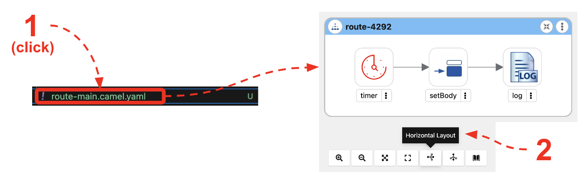
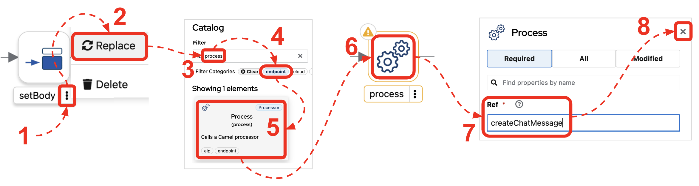
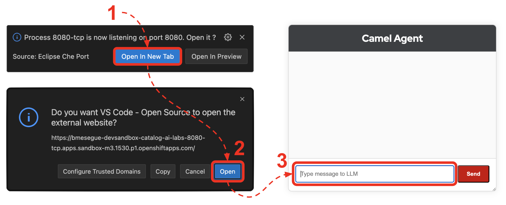
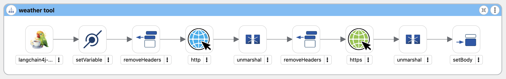
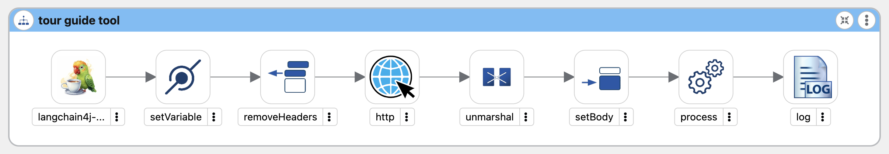

:walkthrough: Lab Introduction
:user-password: openshift
:namespace: {user-username}

:experimental:

:article-url: https://developers.redhat.com/articles/2024/07/22/try-openshift-ai-and-integrate-apache-camel

:sp-article-url: https://developers.redhat.com/articles/2024/05/24/implement-ai-driven-edge-core-data-pipelines

:eip-explorer-url: https://ibek.github.io/integration-explorer-web/#

// :btn-text: my text
// :btn: pass:attributes[<code><mark style="background-color: dodgerblue; color: white">&nbsp;{btn-text}&nbsp;</mark>]

ifdef::env-github[]
endif::[]

[id='lab-intro']
= LLM tools

// Explore, build, test and deploy a Camel X demo application using the Developer Sandbox and OpenShift Dev Spaces.

Gain familiarity with LLM tools by learning how to easily create them with Apache Camel. In this lab, you'll create an agent that uses live feeds to assist clients. 

This hands-on lab is based on the following article in _Red Hat Developers_:

* link:{article-url}[​​Try OpenShift AI and integrate with Apache Camel,window="_blank", , id="rhd-source-article"] +
PENDING TO UPDATE LINK AND TITLE

{blank}

The picture below illustrates the journey the lab will take you on, starting from a base concept and entering a prototyping loop, iterating and refining the concept. The lab shows you how to work in rapid cycles, adding and testing new elements, an UI, (LLM) tools, connectivity (APIs). When the prototype is validated and ready, the tooling will help you to effortlessly export, package, containerise and deploy the application on _OpenShift_.

{blank}

Above all, the lab intends to introduce you to the capabilities of _Apache Camel_, the most popular open-source integration framework, as a vehicle to easily create LLM-powered applications.

{empty} +

[time=1]
[id="intro"]
== Introduction

This tutorial gifts you the opportunity to enjoy a free to use environment, fully browser-based (no installs required in your machine), so that you can start playing immediately with very exciting technologies.

In this occasion, it is all about Large Language Models, and how _Apache Camel_ brings a ton of new and very cool functionality allowing you to create data flows and integrations to implement LLM-based services with tools support.

image::images/13-intro-lab.png[align=center,width=60%]

// {empty} +

=== Takeaways

This hands-on lab will help you to:

- Discover new functionality in _Camel_ to implement **AI** use cases.
- Better understand LLMs and how to leverage the use of **_Tools_**.
- Try out the **_Kaoto_** UI to graphically create _Camel_ routes.
- Accelerate the prototyping phase with **_Camel JBang_**.
- Learn how to use brand new features in _Camel_ _JBang_ like:
** its **kubernetes plugin** to deploy _Camel_ in _OpenShift_.
** its **HTML server** to easily test, package and deploy pages.
- Browse and learn _Camel_ components and patterns with the new _**Enterprise Integration Explorer.**_  
- Get familiar with **_Dev Spaces_** and the _Developer Sandbox_.

{empty} +

=== Disclaimers

Although the Developer Sandbox opens for you the door to try out technologies, its limited resources, particularly CPU/GPU, are really a big constraint when it comes to showcase AI scenarios.

This tutorial managed to include a tiny LLM with tool support (function calling) gifting you the chance to try out very interesting interactions with the model. You will deploy the LLM and you will create processing flows using _Apache Camel_ connected to the LLM. 

The caveat is that you will probably encounter moments where the LLM deviates from the expected behaviour due to the tight resource constraints in the environment. LLMs are very CPU/GPU demanding, and their accuracy badly suffers when restricted.

Please understand these misbehaviours are to be expected. You'll get higher chances of success when sticking to the commands and guidance of the tutorial. In any case, be patient and try variations in your interactions when the LLM responds unexpectedly. Of course, feel free at all times to experiment and improvise your own interactions.

Even though waiting times (in LLM responses) are always kept within reasonable margins, you may experience longer delays as you make progress in the lab, this is normal when you gradually add processing logic and increase LLM exchanges. Please be patient and keep in mind the limited computing power available in the environment.

In any case, we trust you will really enjoy the experience no matter what. This is a unique chance and we've put a lot of effort in it for your delight.

{empty} +

[type=verification]
Did you read and understand the disclaimers?

[type=verificationSuccess]
Enjoy the tutorial!

[type=verificationFail]
It's recommended to understand the resource limitations of the sandbox.

[time=1]
[id="setup"]
== Preparation steps

=== Enable auto-save

. Toggle auto-save on (✓)
+
You'll be making live code changes which _Camel_ can pick up in real time. When the file is saved Camel hot-reloads the changes. +
To speed up hot-reloads, toggle (✓) auto-save in your editor, as illustrated below:
+

+
WARNING: The auto-save option in the menu does not always show when it's active/inactive. If you see in your editor's file tab a permanent white dot `⭘` when you make changes, it means auto-save is OFF.

{empty} +

=== Open a terminal

From DevSpaces, open a terminal following the steps illustrated below:

image::images/04-open-terminal.png[width=40%]

{blank}

You will be prompted at the top of the window to select the working directory. +
Select:

- `llm-basics [.small]#/projects#`
+

{empty} +

=== Copy/Paste commands

You'll use command actions all along the lab. +
To execute commands, perform the steps described below, as illustrated:

image::images/03-copy-actions.png[width=60%]

{blank}

. Click the button _Copy to clipboard_
. Paste the command in the terminal:
- on Linux: kbd:[Ctrl+Shift+v] and press kbd:[Enter] 
- on Mac: kbd:[⌘+v] and press kbd:[Enter]
+
--
WARNING: It's been reported that these key-combos not always work. Your machine may not respond to the above descriptions. Please try other key or mouse click alternatives, for example, right-click, or middle-click.
--

{blank}

=== Setup the lab

Copy and paste in your terminal the following command:

[source, subs=]
----
source setup 
----

{blank}

The command above:

- Creates a `lab` directory (your working directory)
- Switches to your `lab` directory.
+
NOTE: You'll see `lab` empty when your start the tutorial the first time.

{empty} +

=== Tips for a better learning

If you have a wide monitor, or can organise your browser tabs in a multi-monitor configuration, it is mostly recommended to position your _DevSpaces_ view and your lab instructions side by side, as per the image below:

{empty} +

[type=verification]
Is your terminal open and located in your `lab` directory?

[type=verificationSuccess]
👍 You're ready to roll!

[type=verificationFail]
Review the instructions above and ensure you run the `setup` script.

[time=2]
[id="deploy-llm"]
== Deploy the LLM

Copy and paste in your terminal the following command:

[source, subs=]
----
oc apply -f /projects/llm-basics/deploy/tools/llm-server.yaml 
----

{blank}

You should see the following output:

----
persistentvolumeclaim/llm-storage created
deployment.apps/llm-server created
service/llm created
----

{blank}

Wait for the LLM Server to be available. +
You can verify in various ways if you're LLM server is running. One way, for example, is calling the server's API. Try the `curl` command below:

[source, subs=]
----
curl http://llm:8000/api/tags | jq 
----

{blank}

Your server will be ready when you get a response with details of the model deployed.

----
{
  "models": [
    {
      "name": "sam4096/qwen2tools:0.5b",
      "model": "sam4096/qwen2tools:0.5b",
      "modified_at": "2024-09-10T17:05:29.965922378Z",
      "size": 352165374,
      "digest": "ff120c9ea730cd6b7f772ae9ff9127357bf8d8fb7625df601b81e79810a68083",
      "details": {
        "parent_model": "",
        "format": "gguf",
        "family": "qwen2",
        "families": [
          "qwen2"
        ],
        "parameter_size": "494.03M",
        "quantization_level": "Q4_0"
      }
    }
  ]
}
----

NOTE: In the details above, you'll notice this is 0.5B model, which is extremely small. Expect from the model to be very unpredictable. However it'll be very helpful in this tutorial to help you understand the mechanics of LLMs and the functionality the lab showcases.

{empty} +

[type=verification]
Is your LLM server running?

[type=verificationSuccess]
👍 jump to the next section!

[type=verificationFail]
Review the instructions and try again.

[time=5]
[id="basic-llm-interaction"]
== Basic LLM interaction

++++

++++

=== Start the lab

At first, your `lab` directory is empty:

--
[.indent2]
📁 llm-basics/camel/tools/lab +
pass:[<mark style="padding-left: 2rem; background-color: white; color: grey"></mark>] [empty]
--

{blank}

[IMPORTANT]
====
Issue the command below to officially start your lab:

[source, subs=]
----
start 
----

NOTE: The command will initialise the lab with a couple of files.
====

// {empty} +

[NOTE]
====
The lab has a collection of handy scripts you'll need to use when instructed, such as:

- *start* / *restart*
- *ff* (fast-forward to the next step)
- *rw* (rewind to the previous step)
- *step* (jump to step)
- *chat* (curl-based script to interact with _Camel_)
====

{empty} +

=== Your files

After initialisation, under the `lab` directory, you'll find the following source files:

--
[.indent2]
📁 llm-basics/camel/tools/lab +
pass:[<mark style="padding-left: 2rem; background-color: white; color: grey"><b>⚙</b></mark>] applications.properties +
pass:[<mark style="padding-left: 2rem; background-color: white; color: red"><b>J</b></mark>] *model.java*
--

{blank}

Make sure the files are visible in your file explorer in the left panel of _VSCode_. +
Feel free to inspect the files in your editor. +

{empty} +

==== Apache Camel and Langchain4j

_Apache Camel_ integrates with LLMs by providing a number of connectors (called components) that leverage the power of link:https://docs.langchain4j.dev/[_LangChain4j_,window="_blank"].

image::images/12-camel-langchain4j.png[width=30%]

{blank}

_Camel_ routes (integration processes) are typically defined in one of the following DSLs (_Domain Specific Language_): YAML, XML or Java.

You use the DSL alone to define the end to end integration process. DSLs have all the versatility and richness you need to perform all the data manipulations and endpoint connectivity resolution. 

Connectors in _Apache Camel_ are used directly from the DSL, but some, like the _LangChain4j_-based ones, may require initialisation code in Java. Ideally you'd want no code at all, yet it provides the developer full control.

The java file provided (`model.java`) contains the _LangChain4j_-based code needed to enable LLM interaction. +
Two key _LangChain4j_ objects are key:

. The *ChatLanguageModel* object
+
This is the java object that configures connectivity and model parameters. Below you have an extract from the source file showing its definition:
+
----
ChatLanguageModel model = OpenAiChatModel.builder()
          .apiKey("EMPTY")
          .modelName("sam4096/qwen2tools:0.5b")
          .baseUrl("http://llm:8000/v1/")
          .temperature(0.0)
          .timeout(ofSeconds(180))
          .logRequests(true)
          .logResponses(true)
          .build();
----
+
{empty} +

. The *ChatMessage* object
+
Every time the application interacts with the LLM, the query (and related metadata) is encapsulated in a _ChatMessage_ object.
+
Because creating the object requires a specific use of the _LangChain4j_ API, you want to wrap it in a _Camel Processor_ (java code).
+
The snippet below shows you how `model.java` defines the _Camel_ processor containing the _LangChain4j_ code.
+
----
    @BindToRegistry
    public static Processor createChatMessage(){
        ...
        List<ChatMessage> messages = new ArrayList<>();
        ...
    }
----
+
{blank}
+
In the definition above, `createChatMessage` represents the name of the _Processor_. +
From a _Camel_ route, you just need to reference the processor to execute it.
+
NOTE: Later in the lab, the tutorial explains in more detail how the _ChatMessage_ object is created.

{empty} +

Notice the following two facts:

* Your entire source code (for now) only consists of a single file (`model.java`). +
* At this stage no _Camel_ route definitions exists.

{blank}

Your task in the following section is to create a _Camel_ route that enables user/LLM interaction.

{empty} +

=== Create your Camel route using Kaoto.

_Kaoto_ is a graphical UI that will help you to build _Camel_ routes using an intuitive user interface helping you to learn about _Camel_.

[TIP]
.⏩ *Fast-Forward* 
====
Only if you want to skip (automate) the _Kaoto_ creation process, execute in your terminal the command below:

. Run the fast-forward command:
+
[source, subs=]
----
ff 
----
+
{blank}

. Then <<talk-to-llm,click here to bypass the Kaoto instructions and jump to the next section "*_Talk to your LLM_*">>.
====

{empty} +

If you're happy to continue and learn how to use Kaoto, follow the instructions below:

. First, create the source file.
+
--
Run the following command:

[source, subs=]
----
camel init route-main.yaml 
----

{blank}

This action will create a simple Camel route that activates and logs a trace every second. +
Run the code with the following command:
[source, subs=]
----
camel run * --dev 
----

NOTE: The flag `--dev` indicates to run in _Developer mode_ which will apply and run the changes on the fly.

You'll see your terminal logging in a loop the following output:

----
... Hello Camel from route1
... Hello Camel from route1
... Hello Camel from route1
----
--
+
{empty} +

. Open the Camel definition with the _Kaoto Graphical Editor_.
+
======

NOTE: Your _VS Code_ environment has been provisioned with the _Kaoto Graphical Editor_ extension. It allows you to visualise and graphically edit _Camel_ definitions with point-n-click.

Now you'll start making updates in the route and Camel will react to the changes, hot-reload the route, and you'll get to see in your terminal traces of your live updates.

Follow the actions below illustrated:

. Right click on the source code file:
- lab -> `**route-main.yaml**` 
+
{blank}

. From the options displayed, select:
- Open with _Kaoto Graphical Editor for Camel_
+
{blank}

. The process displays vertically by default
+
--
- Click the *_Horizontal Layout_* for left-to-right reading.
--

{blank}

======

. Configure an HTTP listener
+
======
Follow the actions below to replace the Timer starting component by the Platform-HTTP one:

image::images/07-kaoto-from-http.png[]

Make sure you configure the `path` parameter with:

- `/camel/chat`
======
+
{empty} +

. Configure the Java processor
+
======
Follow the actions below to replace the setBody action by a Process one:

Make sure you configure the `Ref` parameter with:

- `createChatMessage`
======
+
{empty} +

. Configure the LLM connector
+
======
Follow the actions below to append (after the Process) the `langchain4j-chat` component:

image::images/09-kaoto-langchain.png[]

Make sure you configure the parameters below as indicated:

- **Chat Id**: `getInformation`
- **Chat Operation**: `CHAT_MULTIPLE_MESSAGES`
======
+
{empty} +

You're done. +
You should end up with a process definition similar to:

image::images/10-kaoto-full-route.png[width=50%, align=left]

{blank}

[TIP]
====
The _Enterprise Integration Explorer_ is a tool to deep dive into the components and patterns _Apache Camel_ implements.

Click link:{eip-explorer-url}/?q=platform-http,langchain4j-chat,log[*Components*,window="_blank"] and link:{eip-explorer-url}/patterns?q=custom-logic[*Patterns*,window="_blank"] to know more about the activities included in the process definition above.
====

{empty} +

// we need to set the anchor before the title, otherwise it doesn't work
[[talk-to-llm]] {empty} +

=== Talk to your LLM.

Your `lab` folder now includes the file `route-main.yaml` that contains a _Camel_ route able to listen to HTTP requests.

[NOTE]
====
If the route is not already running, use _Camel JBang_ to start it:

[source, subs=]
----
camel run * 
----

====

{empty} +

Next, split your terminal by clicking the button as per the image below:

{blank}

From the new terminal, try sending an HTTP request. +
For example:

[source, subs=]
----
curl -H "content-type: text" localhost:8080/camel/chat -d "hello" 
----

[TIP] 
====
The tutorial includes a handy tester based on the same `curl` command as above. +
You can run the same test with:

[source, subs=]
----
chat hello 
----
====

{blank}

After you run the test above, you should see in the logs interactions back and forth between Camel and the LLM, with a final response in the lines of:

----
Hello! How can I assist you today?
----

{empty} +

The above interaction should return a welcoming message from the LLM.

{empty} +

=== Ask for real time data

Your LLM is currently disconnected from any live service and it can't provide real time information about the world.

The code is configured to instruct the LLM to ensure the user is informed about it. The snippet below, extracted from the `model.java` source file, shows you how this is done:

----
String tools = """
          When asked to provide real time data (information), respond with:

          - I'm sorry, I don't have access to real time information.

          Do not improvise answers for any real time related questions.
          """;
----

WARNING: Because our LLM is super small, its behaviour might divert from the above instruction and improvise a response that appears realistic. Responses that are incorrect or misleading, and are presented as facts are known as *hallucinations*.

Try out what happens when you ask the LLM (via Camel) to provide real time information. +
Try the following command from your terminal:
[source, subs=]
----
chat Please provide real time weather information about London. 
----

{blank}

If the LLM is loyal to its instructions, it should respond with something similar to the following:

----
I'm sorry, but as an AI language model, I am unable to provide real-time weather information about London due to the current limitations of my capabilities.
...
----

TIP: If the LLM answered with an hallucination, try varying the request slightly and see if the result improves.

{empty} +

[type=verification]
Did your LLM offer assistance when greeted?

[type=verificationSuccess]
Wonderful!

[type=verificationFail]
Maybe Camel didn't succeed to communicate with the LLM, review the instructions and try again.

[type=verification]
Did your LLM inform you it can't obtain real-time data?

[type=verificationSuccess]
You've completed the basic processing flow to connect Camel to the LLM.

[type=verificationFail]
The LLM may have hallucinated. Please try again modifying slightly your request.

[time=3]
[id="html-serving"]
== Add a Chat UI

=== Setup

[IMPORTANT]
====
Stop Camel with kbd:[Ctrl+c] and setup the lab stage by running the following command:

[source, subs=]
----
step 2 
----

NOTE: The command will reset the lab at this particular stage.
====

=== Camel JBang is your weapon of choice

You're in the prototyping phase, you're creating code that you are rapidly changing and experimenting with. This is the phase were you're exploring how far you can go building powerful functionality.

_Camel JBang_ was built with prototyping in mind. In this lab, you already enjoyed the sublime simplicity of running Camel routes without having to scaffold a project skeleton or worry about library dependencies.

Think for a moment the abilities _Camel JBang_ empowers the developer with. To begin with, starting from an empty folder, you can:

pass:[<mark style="padding-left: 2rem; background-color: white; color: grey"></mark>]-> Create pass:[<b style="font-size: 20px">ONE</b>] single Camel file in a flash, and run it on the spot, making code updates that _Camel JBang_ picks up and applies on the fly.

// For starters, from an empty folder, in a flash you can: +

// pass:[<mark style="padding-left: 2rem; background-color: white; color: grey"></mark>]-> Create pass:[<b style="font-size: 20px">ONE</b>] single Camel file and run it on the spot, making code updates that _Camel JBang_ picks up and applies on the fly.

Think about it... +
Can you say the same for other programming languages and frameworks?

_Camel JBang_ comes packed with a ton of functionality you can use: it's Developer's paradise!

{empty} +

=== Create a Chat UI

One cool feature _Camel JBang_ has recently added to its repertoire is the ability to serve HTML content to equip your Camel process with web pages. 

Let's benefit from the new feature to add a bit of dynamic HTML code to create an UI interface that allow users to talk to the LLM.

The mechanism is simple (in Camel JBang fashion), you just add your HTML content along with the rest of source files.

Don't panic, you're not being asked to build an HTML interface, just fast-forward the lab and the HTML example will be added to your working folder:

[IMPORTANT]
.⏩ *Fast-Forward* 
====
Execute in your terminal the command below:

[source, subs=]
----
ff 
----
====

After doing so, a couple of parameters are added to you `aplication.properties` (to activate the web server), and a couple of files (web page) are added to your lab working directory:
//{empty} +

--
[.indent2]
📁 llm-basics/camel/tools/lab +
// pass:[<mark style="padding-left: 2rem; background-color: white; color: grey"><b>&nbsp;⚙&nbsp;</b></mark>]  applications.properties +
pass:[<mark style="padding-left: 2rem; background-color: white; color: red; font-family: Arial Narrow;"><b style="letter-spacing: 0px;"><></b></mark>] *index.html* +
// pass:[<mark style="padding-left: 2rem; background-color: white; color: red"><b>&nbsp;J&nbsp;</b></mark>] model.java +
// pass:[<mark style="padding-left: 2rem; background-color: white; color: purple"><b><i>&nbsp;!&nbsp;&nbsp;</i></b></mark>] routes.yaml +
pass:[<mark style="padding-left: 2rem; background-color: white; color: red"><b><i>&nbsp;#&nbsp;</i></b></mark>] *style.css*
--

{empty} +

=== Try the Chat UI

Give it a try, launch _Camel JBang_ as usual with:

[source, subs=]
----
camel run * 
----

{blank}

_Dev Spaces_ will prompt you to open the page, follow the actions illustrated below:

{blank}

Go ahead and type a chat line, for example:

[source, subs=]
----
How are you today? 
----
{blank}

You should get a response similar to:

- *LLM:* I am doing well, thank you! How about you?

{empty} +

=== Explore more Camel JBang features

To quickly illustrate another useful feature, Camel JBang includes a web based _Developer Console_.

Activate the _Developer Console_ using the flag `--console` as per the command below:

[source, subs=]
----
camel run * --console 
----

{blank}

You'll be prompted again to open the port `8080` in a new browser tab. +
Do so and, in your browser's address bar, change the URL's path to the following one:

- `/q/dev`

{blank}

You'll find a ton of information you can access. +
Try for example:

- pass:[<u style="color:blue">top</u>: Display the top routes]

{blank}

It should show you something similar to:

----
Top Routes:

    Route Id: main
    From: platform-http:///camel/chat
    Source: file:route-main.yaml:4
    Total: 3
    Failed: 0
    Inflight: 0
    Mean Time: 4s569ms
    Max Time: 8s632ms
    Min Time: 2s227ms
    Last Time: 2s849ms
    Delta Time: 622ms
    Total Time: 13s708ms
----

{empty} +

The examples from above show cool features (out of many) _Camel JBang_ includes. +
Feel free to explore more by reading its link:https://camel.apache.org/manual/camel-jbang.html[​documentation,window="_blank", , id="rhd-source-article"] page.  

// {empty} +

[TIP]
====

You can always invoke _Camel JBang_'s help command, from the terminal, to discover all options and flags available:

[source, subs=]
----
camel --help 
----

{blank}

You also have more granular help per-command. For example, try the following:

[source, subs=]
----
camel get --help 
----
====

{empty} +

[type=verification]
Did you get a response from your LLM in your Chat UI?

[type=verificationSuccess]
Excellent!

[type=verificationFail]
Please review the steps of this chapter and try again. You can always use the commands `rw` (rewind) followed by `ff` (fast-forward) to reset the lab stage.

[time=3]
[id="llm-tool-weather"]
== Create first LLM tool (v1 offline)

=== Setup

[IMPORTANT]
====
Stop Camel with kbd:[Ctrl+c] and setup the lab stage by running the following command:

[source, subs=]
----
step 4 
----

NOTE: The command will reset the lab at this particular stage.
====

{empty} +

=== What are LLM tools?

Certain LLMs (not all) have been trained to support *Tools*. Tools are external functions the LLM can invoke in order to obtain the information it needs to complete the answer to the user.

NOTE: Our super tiny LLM can actually support tools!

When an LLM has been fine-tuned to support tools, you can ask questions to the LLM, as usual, and additionally indicate:

- _"By the way, here you have some tools you can use to complete your answer."_

{blank}

In _Apache Camel_, the link:https://camel.apache.org/components/next/langchain4j-tools-component.html[LangChain4j Tools,window="_blank", , id="rhd-source-article"] component makes it very easy to create tools the LLM can consume. 

{empty} +

### First iteration of a Weather Tool

The end goal is to use _Camel_ to enable the LLM the ability to obtain real time data. The LLM alone can't do it, unless assisted.

To simplify the creation process, first, you will inject dummy weather data by hardcoding values in a _Camel_ route you will create. The JSON data below illustrates such a response:

[subs="quotes"]
----
{
  "weather":{
    "temperature": "*35 degrees celsius*"
  }
}
----

NOTE: In this first iteration the static value `35 degrees celsius` will be hardcoded and returned to the LLM.

{blank}

Although this first version won't fetch real time data, it will help you validate the mechanism by which the LLM retrieves the information and it will give you a better understanding on how _Camel_ and the LLM interact.

[TIP]
.⏩ *Fast-Forward* 
====
To skip (fast-forward) this section, execute in your terminal the commands below:

[source, subs=]
----
ff 
----

{blank}

Then <<test-first-tool,click here to jump into the next section "*_Test the weather tool_*">>.
====

PENDING INSTRUCTIONS TO CREATE FLOW

You're done. +
You should end up with a flow similar to:

{blank}

// [TIP]
// ====
TIP: Click link:{eip-explorer-url}/?q=langchain4j-chat,log[*Components*,window="_blank"] and link:{eip-explorer-url}/patterns?q=content-filter[*Patterns*,window="_blank"] to know more about the activities included in the process definition above.
// ====

{empty} +

// we need to set the anchor before the title, otherwise it doesn't work

[[test-first-tool]] {empty} +

### Test the weather tool

To test the tool, all you need to do is to talk to the LLM and ask the same question as in the earlier section, except expecting the LLM to callback the function (tool), implemented in _Camel_ as a route.

[NOTE]
--
Be patient waiting for LLM responses due to:

* Low CPU power in the sandbox environment.
* Increase in Camel/LLM exchanges resolving tool interactions. 
--

{blank}

Follow the steps below:

. Launch _Camel JBang_ as usual with:
+
[source, subs=]
----
camel run * 
----
+
{blank}

. Talk to the LLM using the _Chat UI_, or `chat` command, by issuing the following query:
+
[source, subs=]
----
Hi, please let me know the current temperature in London
----

{empty} +

After a few seconds, you should obtain a response similar to:

{blank}

TIP: If the LLM provided an AI hallucination, try varying the request slightly and see if the result improves.

Although you know _"35 degrees Celsius"_ is the correct answer, you could validate the LLM's response (in the _Chat UI_) by correlating the information with the actual Camel tool result. 

The JSON data shown below is an extract, from the logs in the terminal, showing the content Camel sent back to the LLM, which aligns with the answer displayed in the Chat UI:

----
{
  "weather": {
    "location": "London",
    "temperature": "35 degrees celsius"
  }
}
----
NOTE: the JSON structure above has been pretty-printed for better readability.

// By digging into the execution logs from the terminal, you could obtain the tool's answer given back to the LLM.

{empty} +

### Visual representation of Tool calling

From your first tool test above you can deduce what's going on between Camel and the LLM. If you inspect carefully your terminal logs you'll identify all the exchanges between both parties.

The sequence diagram below describes the interactions involved when the LLM uses a tool:

{empty} +

{empty} +

[type=verification]
Did you see the LLM calling the tool and answering as expected?

[type=verificationSuccess]
Excellent!

[type=verificationFail]
Please review the steps of this chapter and try again.

[time=3]
[id="llm-tool-weather-live"]
== Finish first LLM tool (v2 online)

=== Setup

[IMPORTANT]
====
Stop Camel with kbd:[Ctrl+c] and setup the lab stage by running the following command:

[source, subs=]
----
step 5 
----

NOTE: The command will reset the lab at this particular stage.
====

{empty} +

### Live weather information

Hardcoding dummy responses, as done in the previous chapter, is helpful to validate the theory really works. Now, let's keep iterating the code and improve it by calling online services providing real time feeds.

This time, when the LLM calls the tool, you will use in your _Camel_ route the following free services:

* link:https://open-meteo.com[​Free Weather API,window="_blank", , id="rhd-source-article"]

* link:http://geodb-cities-api.wirefreethought.com/[GeoDB Cities API,window="_blank", , id="rhd-source-article"]

{blank}

The first API alone provides the weather information you need, however it expects geo-location data in the form of `latitude`/`longitude` inputs.

NOTE: Your _Camel_ tool defines the `location` parameter under the assumption users provide well known city names, like: Paris, London, Madrid, etc. 

The second API (GeoDB) allows you to convert the name of cities to their latitude/longitude coordinates.

The sequence diagram below describes the flow where the LLM calls the tool, live weather data is obtained, then formatted and delivered to the LLM:

{blank}

To accelerate the completion of the processing logic, Fast-Forward as indicated below (the _Camel_ route will be auto-generated).

NOTE: Feel free to complete the process using the _Kaoto_ UI if that's what you prefer. 

[IMPORTANT]
.⏩ *Fast-Forward* 
====
Execute in your terminal the command below:

[source, subs=]
----
ff 
----
====

{empty} +

If you refresh Kaoto, you should end up with a flow similar to:

{blank}

// [TIP]
// ====
TIP: Click link:{eip-explorer-url}/?q=langchain4j-chat,http,https,log[*Components*,window="_blank"] and link:{eip-explorer-url}/patterns?q=content-filter,message-translator[*Patterns*,window="_blank"] to know more about the activities included in the process definition above.
// ====

Feel free to explore each one of the activities and their configuration. You can also open the file in _VScode_ in its raw YAML format.

There are two key actions interesting to highlight:

. Setting a `coordinates` variable
+
The first _GeoDB_ call gives you back, in JSON format, the latitude and longitude. You use Camel's '_Simple_' language to define an expression that extracts the coordinates and formats them into query parameters to inject in the next API call.
+
The code extract below shows you hot it's defined in YAML: 
+
----
  - setVariable:
      name: coordinates
      simple:
        expression: "latitude=${body[data][0][latitude]}&longitude=${body[data][0][longitude]}"

----
+
{blank}

. The tool's JSON response
+
Another highlight is how the response is constructed, also defined using the '_Simple_' language. It gathers from the _Weather API_'s response all the necessary bits and formats a JSON response the LLM will parse.
+
The extract below in YAML shows you how it is done:
+
----
  expression: >-
    {
      "unit":"celsius",
      "temperature": {
          "today": {
            "${body[daily][time][0]}": "${body[current][temperature_2m]}"
          },
          "forecast": {
            "${body[daily][time][1]}": {
              "maximum":"${body[daily][temperature_2m_max][1]}"
              },
            "${body[daily][time][2]}": {
              "maximum":"${body[daily][temperature_2m_max][2]}"
              }
          }
      }
    }
----

{empty} +

### Give the weather tool a spin

Talk to your LLM to try out the new code.

[NOTE]
--
Be patient waiting for LLM responses due to:

* Low CPU power in the sandbox environment.
* Increase in Camel/LLM exchanges resolving tool interactions. 
--

{blank}

Follow the steps below:

. Launch _Camel JBang_ as usual with:
+
[source, subs=]
----
camel run * 
----
+
{blank}

. Talk to the LLM using the _Chat UI_, or `chat` command, by issuing the following query:
+
[source, subs=]
----
Hi, please let me know the current temperature in Paris
----

{empty} +

You should get a response similar to:

// image::images/21-tool-guide-llm-response.png[width=50%, align=center]

{blank}

When digging into the execution logs for the interaction shown in the picture above, we find the original tool's response generated by Camel. In this particular example we find a surprising 100% LLM response accuracy, perhaps just missing the decimal accuracy:

----
{
  "unit": "celsius",
  "temperature": {
    "today": {
      "2024-09-12": "14.0"
    },
    "forecast": {
      "2024-09-13": {
        "maximum": "17.5"
      },
      "2024-09-14": {
        "maximum": "18.5"
      }
    }
  }
}
----

NOTE: the extract above has been pretty-printed fore easy readability.

{blank}

The 100% accuracy obtained in the example above is actually unusual for such a small LLM.

TIP: If in your test the LLM provided an AI hallucination, try again, or vary the query slightly and see if the result improves.

{empty} +

[type=verification]
Did your LLM successfully respond with real temperatures?

[type=verificationSuccess]
Fabulous!

[type=verificationFail]
The LLM may have hallucinated. Please try again modifying slightly your request.

[time=3]
[id="llm-tool-tour-guide"]
== Create second LLM tool

=== Setup

[IMPORTANT]
====
Stop Camel with kbd:[Ctrl+c] and setup the lab stage by running the following command:

[source, subs=]
----
step 7 
----

[NOTE]
======
The command above will:

- Reset the lab at this particular stage.
- Disable the _Weather_ tool (empty file), to work in isolation on the new one.
======
====

=== Simultaneous LLM tools

Multiple tools can be simultaneously given to the LLM. This greatly opens up the possibility to define more interesting use cases.

When requests are submitted to the LLM, along are included all the tools the LLM can use. The LLM is free to use none, one or multiple tools in parallel to fetch all the relevant information it needs. The LLM alone decides when to use them.

// {empty} +

// === Use Camel to create a second tool

In this stage of the tutorial you will create a basic travel agent that helps users obtain travelling information for a particular touristic destination.

The aim is to combine the following tools:

- *Weather* tool: +
  Already implemented (previous sections). Based on a `location` input parameter, the tool provides real time weather forecasts.

- *Tour guide recommendation* tool: +
  Based on a `location` input parameter, the tool returns the contact details of a recommended local tour guide. 
  
// {blank}

{empty} +

=== Creation process

You will follow the same creation approach as for the weather tool by creating a _Camel_ route that implements the logic to compose a JSON response for the LLM.

There are no public APIs available aligning well with the lab's use case. You will use instead _JavaFaker_, a Java library that will help simulate the scenario. 

What's interesting about link:https://github.com/DiUS/java-faker?tab=readme-ov-file#java-faker[_JavaFaker_,window="_blank"] is that it supports a fairly extended list of link:https://github.com/DiUS/java-faker#supported-locales[locales,window="_blank"] that allows creating realistic data depending on the location provided by the LLM.

You'll need however to map the `location` parameter the LLM provides into a locale you can use with _JavaFaker_. To resolve the conversion you will rely on the same GeoDB API used in the Weather tool from the previous chapter.

All in all, the recommendation tool implemented as a Camel route will follow the sequence of calls illustrated below:

{empty} +

To accelerate the creation of the new tool, Fast-Forward as indicated below (the necessary sources will be auto-generated).

[IMPORTANT]
.⏩ *Fast-Forward* 
====
Execute in your terminal the command below:

[source, subs=]
----
ff 
----
====

{blank}

After executing the fast-forward action, you'll find two new files, listed below:

// {empty} +

++++

++++

--
[.indent2]
📁 llm-basics/camel/tools/lab +
// pass:[<mark style="padding-left: 2rem; background-color: white; color: grey"><b>&nbsp;⚙&nbsp;</b></mark>]  applications.properties +
// pass:[<mark style="padding-left: 2rem; background-color: white; color: red; font-family: Arial Narrow;"><b style="letter-spacing: 0px;"><></b></mark>] *index.html* +
pass:[<mark style="padding-left: 2rem; background-color: white; color: purple"><b><i>&nbsp;!&nbsp;&nbsp;</i></b></mark>] *route-tool-guide.yaml* +
pass:[<mark style="padding-left: 2rem; background-color: white; color: red"><b>&nbsp;J&nbsp;</b></mark>] *processors.java* +
// pass:[<mark style="padding-left: 2rem; background-color: white; color: red"><b><i>&nbsp;#&nbsp;</i></b></mark>] *style.css*
--

{blank}

{empty} +

If you open in Kaoto the newly created tool, you should find a _Camel_ route as the one shown below:

{blank}

// [TIP]
// ====
TIP: Click link:{eip-explorer-url}/?q=langchain4j-tools,http,log[*Components*,window="_blank"] and link:{eip-explorer-url}/patterns?q=content-filter,custom-logic[*Patterns*,window="_blank"] to know more about the activities included in the process definition above.
// ====

{blank}

The new file `processors.java` defines the _Camel Processor_ referenced by the `process` action you see in the _Kaoto_ diagram above. It includes the custom code, using the _JavaFaker_ library as explained earlier, to generate realistic, localised, contact information of a simulated tour guide the system recommends to the user.

{empty} +

### Try the new recommendation tool

Give it a go, follow the steps below:

. Launch _Camel JBang_ as usual with:
+
[source, subs=]
----
camel run * 
----
+
{blank}

. Talk to the LLM using the _Chat UI_, or `chat` command, by issuing the following query:
+
[source, subs=]
----
I plan to visit Paris soon, please recommend a good local tour guide to show me around along with their phone contact. 
----

{empty} +

You should get a response similar to:

// - *LLM:* I recommend the following local tour guide to show you around Paris:
// +
// "Pierre Lemaire" from the city of Paris, France. He can be reached via phone number +33 727134666.

// {empty} +

{blank}

In the interaction above, it's fascinating to observe how the LLM has formulated the response, considering the actual data _Camel_ returned to the LLM, as per the log extract below:

----
{
  "tourGuide": {
    "firstName": "Noémie",
    "lastName": "Roussel",
    "contact": {
      "phone": "07 28 30 31 56"
    }
  }
}
----

NOTE: the extract above has been pretty-printed fore easy readability.

{blank}

In this particular interaction the LLM took the liberty to improvise and went too far, resulting in a deviation from reality, something you would expect given the limitations of the tiny model you're running.

TIP: If in your test the LLM provided an AI hallucination, try again, or vary the query slightly and see if the result improves.

{empty} +

[type=verification]
Did your LLM successfully respond with localised data?

[type=verificationSuccess]
Very well done!

[type=verificationFail]
The LLM may have hallucinated. Please try again modifying slightly your request.

[time=3]
[id="llm-all-tools"]
== Run the LLM using both tools

=== Setup

[IMPORTANT]
====
Stop Camel with kbd:[Ctrl+c] and setup the lab stage by running the following command:

[source, subs=]
----
step 9 
----

[NOTE]
======
The command above will:

- Reset the lab at this particular stage.
- Enable both tools.
======
====

{empty} +

=== Review your sources

This step represents the final milestone in your path to implement the functionality of a complete _Travel Agent_.

Inspecting your `lab` folder you will observe all the _Camel_ routes are fully defined in the following YAML files:

--
[.indent2]
📁 llm-basics/camel/tools/lab +
// pass:[<mark style="padding-left: 2rem; background-color: white; color: grey"><b>&nbsp;⚙&nbsp;</b></mark>]  applications.properties +
// pass:[<mark style="padding-left: 2rem; background-color: white; color: red; font-family: Arial Narrow;"><b style="letter-spacing: 0px;"><></b></mark>] *index.html* +
// pass:[<mark style="padding-left: 2rem; background-color: white; color: red"><b>&nbsp;J&nbsp;</b></mark>] model.java +
pass:[<mark style="padding-left: 2rem; background-color: white; color: purple"><b><i>!&nbsp;</i></b></mark>] *route-main.yaml* +
pass:[<mark style="padding-left: 2rem; background-color: white; color: purple"><b><i>!&nbsp;</i></b></mark>] *route-tool-guide.yaml* +
pass:[<mark style="padding-left: 2rem; background-color: white; color: purple"><b><i>!&nbsp;</i></b></mark>] *route-tool-weather.yaml* +
// pass:[<mark style="padding-left: 2rem; background-color: white; color: red"><b><i>&nbsp;#&nbsp;</i></b></mark>] *style.css*
--

{empty} +

=== Run the tools

Follow the steps below:

. Launch _Camel JBang_ with:
+
[source, subs=]
----
camel run * 
----
+
{blank}

. Talk to the LLM using the _Chat UI_, or `chat` command, by issuing the following query:
+
[source, subs=]
----
I am planning to fly to Paris, what is the weather forecast and please give me the phone number of a good local tour guide you recommend
----

{empty} +

You should get a response similar to:

{blank}

Again, the LLM response from above seems reasonably accurate which is very impressive. Below you'll find the original responses from _Camel_ extracted from the terminal logs:

|====
|*Weather Tool*|*Tour Guide Tool*
a| 
----
{
  "unit": "celsius",
  "temperature": {
    "today": {
      "2024-09-12": "10.4"
    },
    "forecast": {
      "2024-09-13": {
        "maximum": "17.8"
      },
      "2024-09-14": {
        "maximum": "18.2"
      }
    }
  }
}
----
a|
[subs=]
----
{
  "tourGuide": {
    "firstName": "Maëlys",
    "lastName": "Gauthier",
    "contact": {
      "phone": "+33 6 47 65 33 04"
    }
  }
}
 
 
 
 
----
|====

NOTE: the extracts above have been pretty-printed fore easy readability.

{blank}

In this particular interaction the LLM took the liberty to improvise and went too far, resulting in a deviation from reality, something you would expect given the limitations of the tiny model you're running.

TIP: If in your test the LLM provided an AI hallucination, try again, or vary the query slightly and see if the result improves.

{empty} +

[type=verification]
Did your LLM successfully respond combining the data from both tools?

[type=verificationSuccess]
Magnificent!

[type=verificationFail]
The LLM may have hallucinated. Please try again modifying slightly your request.

[time=1]
[id="deploy-camel"]
== From Concept to OpenShift

=== Setup

[IMPORTANT]
====
Stop Camel with kbd:[Ctrl+c] and setup the lab stage by running the following command:

[source, subs=]
----
step 10 
----

NOTE: The command will reset the lab at this particular stage.
====

=== Export action

_Camel JBang_ is unique in that it hides all the complexity of a standard _Java_ project. You work directly with the sources that are relevant to you. This simplicity boosts productivity and rapid iteration. 

At this stage we consider the prototyping phase closed. Now, you will create a _Camel Quarkus_ project out of it, and deploy it on OpenShift.

You will see how the tooling, (_Camel JBang_ and _Quarkus_), makes this process very smooth having not to worry about the packaging and deployment process.

NOTE: _Camel JBang_ is continuously being improved and perfected. There are currently a number of raised tickets to make the whole experience seamless. In the meantime you'll have to perform a number of manual steps while waiting for the release of the enhancements in _Camel JBang_.

// {empty} +

The lab includes an `xx` (export) script to accelerate the conversion from a _Camel JBang_ prototype into a _Camel Quarkus_ project. +
Execute the command below to trigger the export (into Camel Quarkus):

[source, subs=]
----
xx 
----

NOTE: Feel free to open the script and inspect the transformation instructions inside.

{blank}

The summary of actions performed by the script is the following:

- Executes the `camel export *` command (with added flags)
- Removes the `lazy=true` parameter from the `@BindToRegistry` annotation
+
NOTE: This is a workaround while waiting for the next release of Quarkus to be available.
+
- Add the `quarkus-openshift` dependency in the `pom.xml` file.
- Add an exclusion tag, in the _JavaFaker_ dependency, that creates a compilation conflict.
- Cleans the root from the Camel JBang sources (now packaged inside the Maven project).

Executing the export script should result in a terminal output similar to:

----
----

{empty} +

=== Test Camel Quarkus

{empty} +

[type=verification]
Did your LLM successfully respond combining the data from both tools?

[type=verificationSuccess]
Magnificent!

[type=verificationFail]
The LLM may have hallucinated. Please try again modifying slightly your request.

[time=1]
[id="section-learn"]
== Take the solution further ahead

{empty} +

=== 👏 👏 👏 Congratulations for getting this far 👏 👏 👏

{empty} +

What you have learnt today with this tutorial is based on material created to build an AI based _Solution Pattern_. 

We call it:

* link:{sp-article-url}[Edge to Core Data Pipelines for AI/ML,window="_blank", , id="rhd-source-article"]

{empty} +

To learn more about it, follow the link above to find an introduction to the solution pattern and a video demonstration.

If you dive into the pattern, specially after completing this tutorial, you'll find yourself very familiar with its content. The solution pattern goes further ahead and takes the use case to another level showing how to automate the platform to constantly evolve to follow the needs of an organisation.

image::images/31-ai-solution-pattern.png[align=center,width=70%]

WARNING: Before you go, please make sure you clean your sandbox namespace to free up resources. +
Click `pass:[<mark style="background-color: dodgerblue; color: white">&nbsp;Next&nbsp;</mark>]` for detailed instructions.

[time=1]
[id="section-clean"]
== Clean up your namespace

When you're done playing in the _Developer Sandbox_, we recommend deleting all the deployments and artifacts, to free up your namespace, and try out other tutorials or products in the future.

These are in summary the components to delete:

 - Deployed applications and components (_TensorFlow Server_, _Minio_, _Camel_)
 - OpenShift AI workbench and cluster storage.
 - DevSpaces workspace.

{empty} +

=== Delete deployed components

If not there yet, switch to your _DevSpaces_ browser tab.

image::images/21-ai-at-devspaces.png[width=20%]

{blank}

And from the terminal, execute:

[source,console]
----
/projects/ai-basics/deploy/clean.sh
----

{empty} +

=== Delete OpenShift AI components

----
oc get svc,deployment,build,bc,is,route  -o name | grep agent | xargs oc delete
----

Switch to your _OpenShift AI_ browser tab.

image::images/26-ai-at-openshiftai.png[width=20%]

{blank}

And follow the steps indicated below:

. Click *_Data Science Projects_*, from the left menu.
. Select your project (namespace).
. Click the tab *_Workbenches_*.
. Click the 3-dots button (as shown below)
. Click *_Delete workbench_*.
. Click the tab *_Cluster storage_*
. Click the 3-dots button (as shown below)
. Click *_Delete storage_*.
+
{blank}
+
image::images/27-ai-clean-openshiftai.png[]

{empty} +

=== Delete workspace in Dev Spaces 

Finally, Switch to your _DevSpaces_ dashboard tab.

image::images/21-ai-at-devspaces.png[width=20%]

{blank}

And follow the steps indicated below:

. Click *_Workspaces_*, from the left menu.
. Tick the checkbox for `devsandbox-catalog-ai-labs`.
. Click the button `pass:[<mark style="background-color: navy; color: white">&nbsp;Delete&nbsp;</mark>]`.
+
{blank}
+
image::images/28-ai-clean-devspaces.png[width=60%]

{empty} +

[type=verification]
Is your namespace clean from artifacts?

[type=verificationSuccess]
You've successfully cleaned up your namespace !!

[type=verificationFail]
Review the instructions in this chapter and try again.

{empty} +
