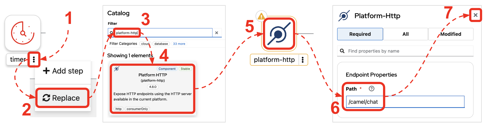
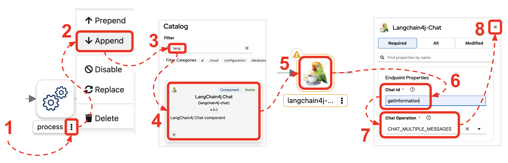

:walkthrough: Lab Introduction
:user-password: openshift
:namespace: {user-username}

:experimental:

:article-url: https://developers.redhat.com/articles/2024/07/22/try-openshift-ai-and-integrate-apache-camel

:sp-article-url: https://developers.redhat.com/articles/2024/05/24/implement-ai-driven-edge-core-data-pipelines

:eip-explorer-url: https://ibek.github.io/integration-explorer-web

// :btn-text: my text
// :btn: pass:attributes[<code><mark style="background-color: dodgerblue; color: white">&nbsp;{btn-text}&nbsp;</mark>]

ifdef::env-github[]
endif::[]

[id='lab-intro']
= LLM tools

// Explore, build, test and deploy a Camel X demo application using the Developer Sandbox and OpenShift Dev Spaces.

Build, deploy & test your model with OpenShift AI, and integrate with Apache Camel using OpenShift Dev Spaces in the Developer Sandbox.

Start your AI journey by learning the very basics of creating, deploying, and invoking a model.

This hands-on lab is based on the following article in _Red Hat Developers_:

* link:{article-url}[​​Try OpenShift AI and integrate with Apache Camel,window="_blank", , id="rhd-source-article"]

{empty} +

For illustration purposes, the picture below shows what the end-to-end processing flow you will build, piece by piece.

image::images/00-intro-end2end.png[align="center", width=60%]

{blank}

You'll train and deploy a customised model, and front it with an (_Apache Camel_) AI-enabled service, serving pricing information for products.

{empty} +

[time=10]
[id="intro"]
== Introduction

The mission of this tutorial is to give you the chance to enjoy a free to use environment, fully browser-based (no installs required in your machine), so that you can start playing immediately with very exciting technologies.

In this occasion, it is all about Large Language Models, and how _Apache Camel_ brings a ton of new and very cool functionality allowing you to create data flows and integrations to implement LLM-based services.

{empty} +

=== Disclaimers

Although the Developer Sandbox offers a great opportunity to try out technologies, its limited resources, particularly CPU/GPU, are really a big constraint when it comes to showcase AI scenarios.

This tutorial managed to include a tiny LLM with tool support (function calling) gifting you the chance to try out very interesting interactions with the model. You will deploy the LLM and you will create processing flows using _Apache Camel_ connected to the LLM. 

The caveat is that you will probably encounter moments where the LLM deviates from the expected behaviour due to the tight resource constraints in the environment. LLMs are very CPU/GPU demanding, and their accuracy badly suffers when restricted.

Please understand these misbehaviours are to be expected. You'll get higher chances of success when sticking to the commands and guidance of the tutorial. In any case, be patient and try variations in your interactions when the LLM responds unexpectedly. Of course, feel free at all times to experiment and improvise your own interactions.

Even though waiting times (in LLM responses) are always kept within reasonable margins, you may experience longer delays as you make progress in the lab, this is normal when you gradually add processing logic and increase LLM exchanges. Please be patient and keep in mind the limited computing power available in the environment.

In any case, we trust you will really enjoy the experience no matter what. This is a unique chance and we've put a lot of effort in it for your delight.

{empty} +

=== What is in it?

This hands-on lab will help you to:

- Discover new functionality in _Camel_ to implement **AI** use cases.
- Better understand LLMs and how to leverage the use of **tools**.
- Try out the **_Kaoto_** UI to graphically create _Camel_ routes.
- Experience how **_Camel JBang_** accelerates your prototyping phase.
- Learn how to use brand new features in _Camel_ _JBang_ like:
** its brand new **kubernetes plugin** to deploy _Camel_ in Op_enShift.
** its **HTML server** to easily test, package and deploy pages.

{empty} +

[time=10]
[id="setup"]
== Preparation steps

The lab has a collection of handy scripts you'll need to use when instructed, such as:

- *restart*
- *ff* (fast-forward to the next step)
- *rw* (rewind to the previous step)
- *step* (jump to step)
- *chat* (curl-based script to interact with _Camel_)

{empty} +

=== Enable auto-save

. Toggle auto-save off
+
You'll be making live code changes which _Camel_ can pick up in real time. +
Toggle (✓) auto-save in your editor, as illustrated below, to automatically trigger hot-reloads.
+
image::images/11-vscode-autosave.png[align="left", width=30%]
+
WARNING: The auto-save option in the menu does not always show when it's active/inactive. If you see in your editor's file tab a permanent white dot `⭘` when you make changes, it means auto-save is OFF.

{empty} +

=== Copy/Paste commands

You'll find command actions all along the lab. +
Perform the two steps illustrated below to complete command executions:

{blank}

. Click the button _Copy to clipboard_
. Paste the command in the terminal:
- on Linux: kbd:[Ctrl+v] and press kbd:[Enter] 
- on Mac: kbd:[⌘+v] and press kbd:[Enter]

{empty} +

=== Setup the lab

From DevSpaces, open a terminal following the steps illustrated below:

image::images/04-open-terminal.png[width=50%]

{blank}

You will be prompted at the top of the window to select the working directory. +
Select:

- `llm-basics [.small]#/projects#`
+
image::images/05-working-dir.png[width=40%]

{empty} +

Copy and paste in your terminal the following command:

[source, subs=]
----
source $LLM_SCRIPTS/setup 
----

{blank}

The command above:

- Includes the lab scripts on your PATH
- Switches to your `lab` directory from where you will work.
+
NOTE: You'll see your `lab` folder is empty when your start the tutorial the first time.

{empty} +

[type=verification]
Is your terminal open and located in your `lab` directory?

[type=verificationSuccess]
👍 You're ready to roll!

[type=verificationFail]
Review the instructions above and ensure you run the `setup` script.

[time=10]
[id="step-1"]
== Step 1. Basic LLM interaction

=== Setup

[IMPORTANT]
====
Setup your lab by running the following command:

[source, subs=]
----
restart 
----

NOTE: The command will reset the lab to its start configuration.
====

{empty} +

=== Your files

After setup, your initial source files, under the `lab` directory are:

++++

++++

--
[.indent2]
📁 llm-basics/camel/tools/lab +
pass:[<mark style="padding-left: 2rem; background-color: white; color: grey"><b>⚙</b></mark>] applications.properties +
pass:[<mark style="padding-left: 2rem; background-color: white; color: red"><b>J</b></mark>] *model.java*
--

{blank}

Feel free to inspect the files in your editor. +

{empty} +

==== Apache Camel and Langchain4j

_Apache Camel_ integrates with LLMs by providing a number of connectors (called components) that leverage the power of link:https://docs.langchain4j.dev/[_LangChain4j_,window="_blank"].

{blank}

_Camel_ routes (integration processes) are typically defined in one of the following DSLs (_Domain Specific Language_): YAML, XML or Java.

You use the DSL alone to define the end to end integration process. DSLs have all the versatility and richness you need to perform all the data manipulations and endpoint connectivity you need. 

Connectors in _Apache Camel_ are used directly from the DSL, but some, like the _LangChain4j_-based ones, may require initialisation code in Java. Ideally you'd want no code at all, yet it provides the developer full control.

The java file we provide (`model.java`) contains the _LangChain4j_-based code needed to enable LLM interaction:

. The *ChatLanguageModel* object
+
This is the java object that configures connectivity and model parameters. Below you have an extract from the source file showing its definition:
+
----
ChatLanguageModel model = OpenAiChatModel.builder()
          .apiKey("EMPTY")
          .modelName("sam4096/qwen2tools:0.5b")
          .baseUrl("http://ollama-svc:8000/v1/")
          .temperature(0.0)
          .timeout(ofSeconds(180))
          .logRequests(true)
          .logResponses(true)
          .build();
----
+
{empty} +

. The *ChatMessage* object
+
Every time the application interacts with the LLM, the query (and related metadata) is encapsulated in a _ChatMessage_ object.
+
Because creating the object requires a specific use of the _LangChain4j_ API, we wrap it in a _Camel Processor_ (java code).
+
The snippet below shows you how `model.java` defines the _Camel_ processor containing the _LangChain4j_ code.
+
----
    @BindToRegistry
    public static Processor createChatMessage(){
        ...
        List<ChatMessage> messages = new ArrayList<>();
        ...
    }
----
+
{blank}
+
In the definition above `createChatMessage` represents the name of the _Processor_. +
From a _Camel_ route we just need to reference the processor to execute it.
+
NOTE: Later in the lab, the tutorial explains in more detail how the _ChatMessage_ object is created.

{empty} +

Notice your entire source code (for now) only consists of a single file (`model.java`). +
At this stage no _Camel_ route definitions exists. Your task in the following section is to create one to enable user/LLM interactions integrated with _Apache Camel_.

{empty} +

=== Create your Camel route using Kaoto.

_Kaoto_ is a graphical UI that will help you to build _Camel_ routes using an intuitive user interface helping you to learn about _Camel_.

[TIP]
.⏩ *Fast-Forward* 
====
Only if you want to skip (automate) the _Kaoto_ creation process, execute in your terminal the command below:

. Run the fast-forward command:
+
[source, subs=]
----
ff 
----
+
{blank}

. Then <<test-first-route,click here to bypass the Kaoto instructions and jump to the next section>>.
====

{empty} +

If you're happy to continue and learn how to use Kaoto, follow the instructions below:

. First, create the source file.
+
--
Run the following command:

[source, subs=]
----
camel init routes.yaml 
----

{blank}

This action will create a simple Camel route that activates and logs a trace every second. +
Run the code with the following command:
[source, subs=]
----
camel run * --dev 
----

NOTE: The flag `--dev` indicates to run in _Developer mode_ which will apply and run the changes on the fly.

You'll see your terminal logging in a loop the following output:

----
... Hello Camel from route1
... Hello Camel from route1
... Hello Camel from route1
----
--
+
{empty} +

. Open the Camel definition with the _Kaoto Graphical Editor_.
+
======

NOTE: Your _VS Code_ environment has been provisioned with the _Kaoto Graphical Editor_ extension. It allows you to visualise and graphically edit _Camel_ definitions with point-n-click.

Now you'll start making updates in the route and Camel will react to the changes, hot-reload the route, and you'll get to see in your terminal traces of your live updates.

Follow the actions below illustrated:

. Right click on the source code file:
- lab -> `**routes.yaml**` 
+
{blank}

. From the options displayed, select:
- Open with _Kaoto Graphical Editor for Camel_
+
{blank}

. The process displays vertically by default
+
--
- Click the *_Horizontal Layout_* for left-to-right reading.
--

{blank}

image::images/06-kaoto-open-routes.png[width=100%]

======

. Configure an HTTP listener
+
======
Follow the actions below to replace the Timer starting component by the Platform-HTTP one:

Make sure you configure the `path` parameter with:

- `/camel/chat`
======
+
{empty} +

. Configure the Java processor
+
======
Follow the actions below to replace the setBody action by a Process one:

image::images/08-kaoto-process.png[]

Make sure you configure the `Ref` parameter with:

- `createChatMessage`
======
+
{empty} +

. Configure the LLM connector
+
======
Follow the actions below to append (after the Process) the `langchain4j-chat` component:

Make sure you configure the parameters below as indicated:

- **Chat Id**: `getInformation`
- **Chat Operation**: `CHAT_MULTIPLE_MESSAGES`
======
+
{empty} +

You're done. +
You should end up with a flow similar to:

image::images/10-kaoto-full-route.png[width=60%, align=left]

{blank}

Browse the Enterprise Integration Explorer if you want to know more about the activities involved in the process above:

Click on the links below to list the activities:

* link:{eip-explorer-url}/#/?q=platform-http,langchain4j-chat,log[Show Components,window="_blank"]
* link:{eip-explorer-url}/#/patterns?q=custom-logic[Show Patterns,window="_blank"]

{empty} +

// we need to set the anchor before the title, otherwise it doesn't work
[[test-first-route]] {empty} +

=== Talk to your LLM.

Your `lab` folder includes now the file `routes.yaml` that contains a _Camel_ route able to listen to HTTP requests.

[NOTE]
====
If the route is not already running, use _Camel JBang_ to start it:

[source, subs=]
----
camel run * 
----

====

{empty} +

Next, split your terminal by clicking the button as per the image below:

image::images/01-split-terminal.png[align="left", width=30%]

{blank}

From the new terminal, try sending an HTTP request. +
For example:

[source, subs=]
----
curl -H "content-type: text" localhost:8080/camel/chat -d "hello" 
----

[TIP] 
====
The tutorial includes a handy tester based on the same `curl` command as above. +
You can run the same test with:

[source, subs=]
----
source $LLM_SCRIPTS/setup
chat hello 
----
====

{blank}

After you run the test above, you should see in the logs back and forth interactions between Camel and the LLM, with a final response in the lines of:

----
Hello! How can I assist you today?
----

{empty} +

The above interaction gives us a welcoming message from the LLM.

{empty} +

=== Ask for real time data

Your LLM is currently disconnected from any live service and it can't provide real time information about the world.

We have configured the LLM to ensure the user is informed bout it. The snippet below, extracted from the `model.java` source file, shows you how this is done:

----
String tools = """
          When asked to provide real time data (information), respond with:

          - I'm sorry, I don't have access to real time information.

          Do not improvise answers for any real time related questions.
          """;
----

WARNING: Because our LLM is super small, its behaviour might divert from the above instruction and improvise a response that appears realistic. Responses that are incorrect or misleading, and are presented as facts are known as *hallucinations*.

Try out what happens when you ask the LLM (via Camel) to provide real time information. +
Try the following:
[source, subs=]
----
chat Please provide me with real time weather information about London. 
----

{blank}

If the LLM is loyal to our instructions, it should respond with something similar to the following:

----
I'm sorry, but as an AI language model, I am unable to provide real-time weather information about London due to the current limitations of my capabilities.
...
----

TIP: If the LLM provided an AI hallucination, try varying the request slightly and see if the result improves.

{empty} +

[type=verification]
Did your LLM offer assistance when greeted?

[type=verificationSuccess]
Wonderful!

[type=verificationFail]
Maybe Camel didn't succeed to communicate with the LLM, review the instructions and try again.

[type=verification]
Did your LLM inform you it can't obtain real-time data?

[type=verificationSuccess]
You've completed the basic processing flow to connect Camel to the LLM.

[type=verificationFail]
The LLM may have hallucinated. Please try again modifying slightly your request.

[time=10]
[id="first-llm-tool"]
== Implement with Camel an LLM tool

=== Setup

[IMPORTANT]
====
Stop Camel with kbd:[Ctrl+c] and setup the lab stage by running the following command:

[source, subs=]
----
step 1 
----

NOTE: The command will reset the lab at this particular stage.
====

{empty} +

=== Get started

Let's now use Camel to equip our LLM with the ability to obtain real time data.

Certain LLMs (not all) have been trained to support *Tools*. Tools are external functions the LLM can invoke in order to obtain the information it needs to complete the answer to the user.

NOTE: Our super tiny LLM can actually support tools!

When an LLM has been fine-tuned to support tools, we can ask questions to the LLM and additionally indicate:

- _"By the way, here you have some tools you can use to complete your answer."_

{blank}

The Apache Camel langchain4j component makes it very easy to create tools the LLM can consume. 

{empty} +

### Dummy weather information

To start with, let's create a Camel route that will provide a dummy response containing weather information.

This first iteration is obviously not providing real time data but helps you validate the mechanism by which the LLM retrieves the information it needs to complete the answer.

[TIP]
.⏩ *Fast-Forward* 
====
To skip (fast-forward) this section, execute in your terminal the commands below:

[source, subs=]
----
ff 
----

{blank}

Then <<test-first-tool,click here to jump into the next section>>.
====

PENDING INSTRUCTIONS TO CREATE FLOW

[[test-first-tool]] {empty} +

### Test the tool

To test the tool all we need to do is to talk to the LLM and ask the same question as in the earlier section, except we expect the LLM to interact with Camel to invoke the function.

[NOTE]
--
Be patient waiting for LLM responses due to:

* Low CPU power in the sandbox environment.
* Increase in Camel/LLM exchanges resolving tool interactions. 
--

{blank}

Chat to your LLM by issuing the following chat command:

[source, subs=]
----
chat Hi, please let me know the current temperature in London 
----

{blank}

After a few seconds, you should obtain a response similar to:

----
The current temperature in London is 35 degrees Celsius.
----

TIP: If the LLM provided an AI hallucination, try varying the request slightly and see if the result improves.

{empty} +

### Live weather information

A dummy response is helpful to validate the theory really works. Now, let's keep iterating the code and improve it by calling online services providing real time data.

When the LLM calls the tool, we will use in our Camel route the following free services:

* link:https://open-meteo.com[​Free Weather API,window="_blank", , id="rhd-source-article"]

* link:http://geodb-cities-api.wirefreethought.com/[GeoDB Cities API,window="_blank", , id="rhd-source-article"]

{blank}

The first API alone provides the weather information we need, however it expects the geo-location in the form of `latitude`/`longitude` inputs.

NOTE: Our Camel tool defines the `location` parameter under the assumption users provide well known city names, like: Paris, London, Madrid, etc. 

The second API (GeoDB) allows us to convert the name of cities to their latitude/longitude coordinates.

To speed up the implementation process, fast-forward as indicated below to auto-generate the Camel route process.

[IMPORTANT]
.⏩ *Fast-Forward* 
====
Execute in your terminal the command below:

[source, subs=]
----
ff 
----
====

{empty} +

EXPLAIN THE FINAL JSON RESPONSE Camel maps

----
  - setVariable:
      name: coordinates
      simple:
        expression: "latitude=${body[data][0][latitude]}&longitude=${body[data][0][longitude]}"

----

----
  expression: >-
    {
      "unit":"celsius",
      "temperature": {
          "today": {
            "${body[daily][time][0]}": "${body[current][temperature_2m]}"
          },
          "forecast": {
            "${body[daily][time][1]}": {
              "maximum":"${body[daily][temperature_2m_max][1]}"
              },
            "${body[daily][time][2]}": {
              "maximum":"${body[daily][temperature_2m_max][2]}"
              }
          }
      }
    }
----

{empty} +

### Test the Camel route

Talk to your LLM to try out the new code.

[NOTE]
--
Be patient waiting for LLM responses due to:

* Low CPU power in the sandbox environment.
* Increase in Camel/LLM exchanges resolving tool interactions. 
--

{blank}

Chat to your LLM by issuing the following chat command:

[source, subs=]
----
chat Hi, please let me know the current temperature in Paris 
----

{blank}

After a few seconds, This time you should obtain a response similar to:

----
The current temperature in Paris is around 19.5°C and the forecast for today shows a maximum of 21.8°C, while tomorrow's forecast suggests a maximum of 18.7°C.
----

TIP: If the LLM provided an AI hallucination, try varying the request slightly and see if the result improves.

This time you should see the LLM utilizing the Tool (Camel) response to compose a human-readable answer.

{empty} +

[time=10]
[id="step-3"]
== Step 3. Multiple LLM tools in parallel

Multiple tools can be offered at once to the LLM. This greatly opens up the possibility to define more interesting use cases.

When requests are submitted to the LLM, along are included all the tools the LLM can use. The LLM is free to use none, one or multiple tools in parallel to fetch all the relevant information it needs. The LLM decides on its own when to use them.

{empty} +

=== Use Camel to create a second tool

Our aim in this part of the tutorial is to create a sort of travel agent that helps users obtain location information for travelling purposes.

We will combine the following tools:

- *Weather* tool: +
  Already implemented (previous sections). Based on a `location` input parameter, the tool provides real time weather forecasts.

- *Tour guide recommendation* tool: +
  Based on a `location` input parameter, the tool returns the contact details of a recommended local tour guide. 
  
{blank}

We will follow the same creation approach as for the weather tool by creating a Camel route that implements the logic to compose a JSON response for the LLM.

There are no public APIs out there that can easily fit into our use case. We will use instead _JavaFaker_, a Java library that will help simulate the information. 

What's interesting about link:https://github.com/DiUS/java-faker?tab=readme-ov-file#java-faker[_JavaFaker_,window="_blank"] is that it supports a fairly extended list of link:https://github.com/DiUS/java-faker#supported-locales[locales,window="_blank"] that allows us to create more realistic data depending on the location provided by the LLM.

We need however to map the `location` parameter the LLM provides into a locale we can use with _JavaFaker_. To resolve the conversion we will rely on the same GeoDB API used in the Weather tool from the previous chapter.

All in all, the recommendation tool implemented as a Camel route will follow the sequence of calls illustrated below:

image::images/02-seq-tool-tour-guide.png[align="center", width=30%]

{blank}

fsdfsdf

, except this time we will rely on a Mock library (Mocker)
less on free online APIs given the nature of this specific tool 

Let's create another tool that combined with the first one already implemented allows the system to behave as a sort of travel agent.

Our aim in this section of the tutorial is to offer richer capabilities that 
In this section of the tutorial, we will combine the previous weather tool with a new one that allows to offer a more complete user experience around a travel use case.

Let's now use Camel to equip our LLM with the ability to obtain real time data.

Certain LLMs (not all) have been trained to support *Tools*. Tools are external functions the LLM can invoke in order to obtain the information it needs to complete the answer to the user.

NOTE: Our super tiny LLM can actually support tools!

When an LLM has been fine-tuned to support tools, we can ask questions to the LLM and additionally indicate:

- _"By the way, here you have some tools you can use to complete your answer."_

{blank}

The Apache Camel langchain4j component makes it very easy to create tools the LLM can consume. 

{empty} +

### Dummy weather information

To start with, let's create a Camel route that will provide a dummy response containing weather information.

This first iteration is obviously not providing real time data but helps you validate the mechanism by which the LLM retrieves the information it needs to complete the answer.

[TIP]
.⏩ *Fast-Forward* 
====
To skip (fast-forward) this section, execute in your terminal the commands below:

[source, subs=]
----
ff 
----

{blank}

Then <<test-first-tool,click here to jump into the next section>>.
====

PENDING INSTRUCTIONS TO CREATE FLOW

[[test-first-tool]] {empty} +

### Test the tool

To test the tool all we need to do is to talk to the LLM and ask the same question as in the earlier section, except we expect the LLM to interact with Camel to invoke the function.

[NOTE]
--
Be patient waiting for LLM responses due to:

* Low CPU power in the sandbox environment.
* Increase in Camel/LLM exchanges resolving tool interactions. 
--

{blank}

Chat to your LLM by issuing the following chat command:

[source, subs=]
----
chat Hi, please let me know the current temperature in London 
----

{blank}

After a few seconds, you should obtain a response similar to:

----
The current temperature in London is 35 degrees Celsius.
----

TIP: If the LLM provided an AI hallucination, try varying the request slightly and see if the result improves.

{empty} +

### Live weather information

A dummy response is helpful to validate the theory really works. Now, let's keep iterating the code and improve it by calling online services providing real time data.

When the LLM calls the tool, we will use in our Camel route the following free services:

* link:https://open-meteo.com[​Free Weather API,window="_blank", , id="rhd-source-article"]

* link:http://geodb-cities-api.wirefreethought.com/[GeoDB Cities API,window="_blank", , id="rhd-source-article"]

While the first API provides the weather information we need, it expects the geo-location in the form of `latitude`/`longitude` inputs.

NOTE: Our Camel tool defines the `location` parameter under the assumption users provide well known city names, for example, Paris, London, Madrid, etc. 

The second API (GeoDB) allows us to convert the name of cities to their latitude/longitude coordinates.

To speed up the implementation process, fast-forward as indicated below to auto-generate the Camel route process.

[IMPORTANT]
.⏩ *Fast-Forward* 
====
Execute in your terminal the command below:

[source, subs=]
----
ff 
----
====

{empty} +

EXPLAIN THE FINAL JSON RESPONSE Camel maps

----
  - setVariable:
      name: coordinates
      simple:
        expression: "latitude=${body[data][0][latitude]}&longitude=${body[data][0][longitude]}"

----

----
  expression: >-
    {
      "unit":"celsius",
      "temperature": {
          "today": {
            "${body[daily][time][0]}": "${body[current][temperature_2m]}"
          },
          "forecast": {
            "${body[daily][time][1]}": {
              "maximum":"${body[daily][temperature_2m_max][1]}"
              },
            "${body[daily][time][2]}": {
              "maximum":"${body[daily][temperature_2m_max][2]}"
              }
          }
      }
    }
----

{empty} +

### Test the Camel route

Talk to your LLM to try out the new code.

[NOTE]
--
Be patient waiting for LLM responses due to:

* Low CPU power in the sandbox environment.
* Increase in Camel/LLM exchanges resolving tool interactions. 
--

{blank}

Chat to your LLM by issuing the following chat command:

[source, subs=]
----
chat Hi, please let me know the current temperature in Paris 
----

{blank}

After a few seconds, This time you should obtain a response similar to:

----
The current temperature in Paris is around 19.5°C and the forecast for today shows a maximum of 21.8°C, while tomorrow's forecast suggests a maximum of 18.7°C.
----

TIP: If the LLM provided an AI hallucination, try varying the request slightly and see if the result improves.

This time you should see the LLM utilizing the Tool (Camel) response to compose a human-readable answer.

{empty} +

[time=2]
[id="section-one"]
== Create an OpenShift AI workbench

This application only needs 2 files:

- A Price Catalogue containing product information
+
📁 `camel/price-catalogue.json`

- The process definition (_Camel_ route)
+
📁 `camel/price.yaml`

{empty} +

The first resource you can look at is the _Price Catalogue_ containing price tags for different types of tea (the products). When a detection is obtained from the model, the application will query the catalogue to find its price tag.

Open in your editor the following file:

* camel -> `**price-catalogue.json**` 
+
{blank}
+
Inside, you'll find the product data relevant for our test:
+
[,json]
----
[   ...
    {
      "item": "tea-green",
      "label": "Green Tea",
      "price": 2.99
    },
    ...
]
----

{empty} +

{empty} +

[time=1]
[id="section-learn"]
== Take the solution further ahead

{empty} +

=== 👏 👏 👏 Congratulations for getting this far 👏 👏 👏

{empty} +

What you have learnt today with this tutorial is based on material created to build an AI based _Solution Pattern_. 

We call it:

* link:{sp-article-url}[Edge to Core Data Pipelines for AI/ML,window="_blank", , id="rhd-source-article"]

{empty} +

To learn more about it, follow the link above to find an introduction to the solution pattern and a video demonstration.

If you dive into the pattern, specially after completing this tutorial, you'll find yourself very familiar with its content. The solution pattern goes further ahead and takes the use case to another level showing how to automate the platform to constantly evolve to follow the needs of an organisation.

image::images/31-ai-solution-pattern.png[align=center,width=70%]

WARNING: Before you go, please make sure you clean your sandbox namespace to free up resources. +
Click `pass:[<mark style="background-color: dodgerblue; color: white">&nbsp;Next&nbsp;</mark>]` for detailed instructions.

[time=1]
[id="section-clean"]
== Clean up your namespace

When you're done playing in the _Developer Sandbox_, we recommend deleting all the deployments and artifacts, to free up your namespace, and try out other tutorials or products in the future.

These are in summary the components to delete:

 - Deployed applications and components (_TensorFlow Server_, _Minio_, _Camel_)
 - OpenShift AI workbench and cluster storage.
 - DevSpaces workspace.

{empty} +

=== Delete deployed components

If not there yet, switch to your _DevSpaces_ browser tab.

image::images/21-ai-at-devspaces.png[width=20%]

{blank}

And from the terminal, execute:

[source,console]
----
/projects/ai-basics/deploy/clean.sh
----

{empty} +

=== Delete OpenShift AI components

Switch to your _OpenShift AI_ browser tab.

image::images/26-ai-at-openshiftai.png[width=20%]

{blank}

And follow the steps indicated below:

. Click *_Data Science Projects_*, from the left menu.
. Select your project (namespace).
. Click the tab *_Workbenches_*.
. Click the 3-dots button (as shown below)
. Click *_Delete workbench_*.
. Click the tab *_Cluster storage_*
. Click the 3-dots button (as shown below)
. Click *_Delete storage_*.
+
{blank}
+
image::images/27-ai-clean-openshiftai.png[]

{empty} +

=== Delete workspace in Dev Spaces 

Finally, Switch to your _DevSpaces_ dashboard tab.

image::images/21-ai-at-devspaces.png[width=20%]

{blank}

And follow the steps indicated below:

. Click *_Workspaces_*, from the left menu.
. Tick the checkbox for `devsandbox-catalog-ai-labs`.
. Click the button `pass:[<mark style="background-color: navy; color: white">&nbsp;Delete&nbsp;</mark>]`.
+
{blank}
+

{empty} +

[type=verification]
Is your namespace clean from artifacts?

[type=verificationSuccess]
You've successfully cleaned up your namespace !!

[type=verificationFail]
Review the instructions in this chapter and try again.

{empty} +
